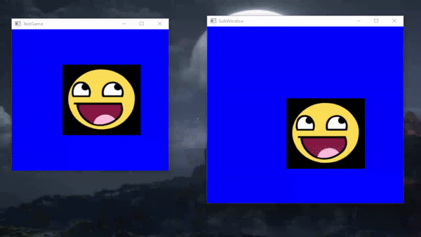

# LameEngine
A 2D game Engine written in C#. Aims to make opening and drawing to multiple windows as easy as possible.

## Dependencies
* [Silk.NET](https://github.com/dotnet/Silk.NET) for windowing and bindings to OpenGL. 
* [StbImageSharp](https://github.com/StbSharp/StbImageSharp) for loading images.

## Example


This is the code that is required to recreate this example using my Engine.
You only need to set up some stuff and do some simple logic inside of the TestObject. 
There is no complicated code necessary.

```cs
 public static class Program
    {
        public static void Main()
        {
            WindowOptions windowOptions = WindowOptions.Default;
            windowOptions.Size = new Vector2D<int>(400, 400);
      
            WindowSettings windowSettings = new WindowSettings(new Vector2D<int>(400, 400));

            Engine engine = new Engine(windowOptions, windowSettings);
            engine.Run(new Game());
        }
    }
```

```cs
public class Game : GameTemplate
{
    public Game()
    {
        WindowOptions windowOptions = WindowOptions.Default;
        windowOptions.Size = new Vector2D<int>(500, 500);
        windowOptions.Title = "SubWindow";
        Vector2D<int> position = windowOptions.Position;
        position.X = 500;
        windowOptions.Position = position; 
        WindowSettings windowSettings = new WindowSettings(new Vector2D<int>(500, 500));


        Window side = Engine.CreateWindow(windowOptions, windowSettings);
        TestObject object1 = new TestObject(side, 200);
        TestObject object2 = new TestObject(Engine.MainWindow, 200);
    }
}
```

```cs
public class TestObject : GameObject
{
    private readonly IKeyboard keyboard;
    private readonly float speed;
    
    public TestObject(Window pWindow, float pSpeed) : base(new Vector2D<float>(200, 200), pTarget: pWindow)
    {
        keyboard = pWindow.InputContext.Keyboards[0];
        speed = pSpeed;
        
        SpriteSettings spriteSettings = new SpriteSettings("Resources/Sprites/awesomeface.png")
        {
            Resolution = new Vector2D<int>(200,200),
        };

        AddComponent(new Sprite(spriteSettings));
    }

    protected override void Update()
    {
        if (!Target.HasFocus)
        {
            return;
        }
        
        Vector2D<float> direction = new Vector2D<float>(0, 0);
        if (keyboard.IsKeyPressed(Key.W))
        {
            direction.Y--;
        }

        if (keyboard.IsKeyPressed(Key.S))
        {
            direction.Y++;
        }

        if (keyboard.IsKeyPressed(Key.A))
        {
            direction.X--;
        }

        if (keyboard.IsKeyPressed(Key.D))
        {
            direction.X++;
        }

        Transform.Position += Engine.DeltaTime * direction * speed;
    }
}
```


